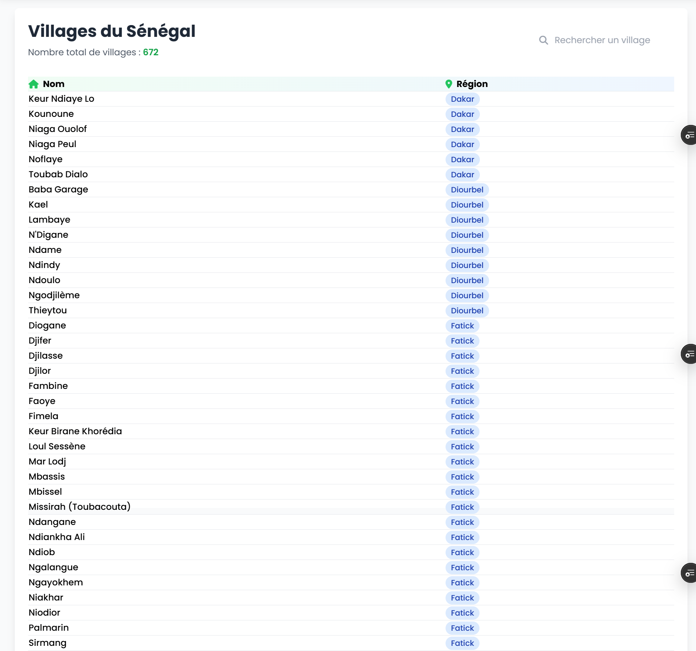

<div align="center">
  
  <h1>GalsenApi</h1>
  <p>
    A modern API to easily access Senegal's data 🇸🇳
  </p>

  <p>
    <a href="./Licence.md">
      
    </a>
    <a href="https://github.com/GalsenDev221/made.in.senegal">
      
    </a>
    
  </p>

  <h4>
    <a href="https://galsenapi.pythonanywhere.com/">Demo</a>
    <span> · </span>
    <a href="https://galsenapi.pythonanywhere.com/docs">Documentation</a>
    <span> · </span>
    <a href="README.md">Version française</a>
  </h4>
</div>

<br />

## 📋 Table of Contents

- [Overview](#-overview)
- [Installation](#-installation)
- [Usage](#-usage)
- [Features](#-features)
- [Tech Stack](#-tech-stack)
- [Author](#-author)
- [Acknowledgements](#-acknowledgements)

## 🚀 Overview

**GalsenApi** is a REST API that allows you to easily access data about Senegal. This project is inspired by the [Galsenify](https://www.npmjs.com/package/galsenify) package and provides detailed information about:

- Regions of Senegal
- Departments
- Villages
- Demographic data
- And more...

## ⚙️ Installation

1. Create a virtual environment:
```bash
python -m venv .venv
```

2. Activate the virtual environment:
```bash
source .venv/bin/activate
```

3. Install dependencies:
```bash
pip install requirements.txt
```

4. Run migrations:
```bash
python manage.py makemigrations
python manage.py migrate
```

5. Create a superuser:
```bash
python manage.py createsuperuser
```

6. Create a `.env` file in the Django project to store the secret key.

## 🎯 Usage

### API Endpoints

#### Get all regions
```http
GET /api/regions/
```

#### Get a single region
```http
GET /api/regions/1/
```

#### Get all departments
```http
GET /api/departements
```

#### Get a single department
```http
GET /api/departements/1/
```

#### Get all villages
```http
GET api/villages
```

#### Get a single village
```http
GET /api/villages/1
```

#### Get country information
```http
GET /api/pays/
```

## 💫 Features

- ✨ Modern and responsive UI
- 📱 Mobile compatible
- 🔍 Advanced search
- 📊 Detailed and up-to-date data
- 🔒 Secure and reliable

## 🛠 Tech Stack

- 
- 
- 
- 

## 👤 Author

**Lassana SIBY**

[](https://github.com/sibylassana95)
[](https://www.linkedin.com/in/sibylassana)
[](https://twitter.com/sibyog13)

## 💝 Acknowledgements

Special thanks to [Daouda BA](https://github.com/daoodaba975) for the data.


## **[Demo 🚀](https://galsenapi.pythonanywhere.com)**

### Example of using the API
Views for regions and departments.
```python
def regions_view(request):
    query = request.GET.get('q')
    url = 'https://galsenapi.pythonanywhere.com/api/regions/'
    params = {'search': query} if query else {}
    response = requests.get(url, params=params)
    data = response.json()
    regions = data
    context = {'regions': regions, 'query': query}
    return render(request, 'demo/regions.html', context)


def departments_view(request):
    query = request.GET.get('q')
    url = 'https://galsenapi.pythonanywhere.com/api/departements/'
    params = {'search': query} if query else {}
    response = requests.get(url, params=params)
    data = response.json()
    departments = data
    context = {'departments': departments, 'query': query}
    return render(request, 'demo/departements.html', context)

def villages_view(request):
    query = request.GET.get('q')
    url = 'https://galsenapi.pythonanywhere.com/api/villages/'
    params = {'search': query} if query else {}
    response = requests.get(url, params=params)
    data = response.json()
    villages = data
    context = {'villages': villages, 'query': query}
    return render(request, 'demo/village.html', context)    
```




## 📝 License

[](./Licence.md)

[](https://github.com/GalsenDev221/made.in.senegal)
<div align="center">
  <a href="https://www.buymeacoffee.com/sibyamara9M">
    
  </a>
  <a href="https://paypal.me/sibylassana">
    
  </a>
</div>
<p align="right">(<a href="#readme-top">
back to top</a>)</p>
