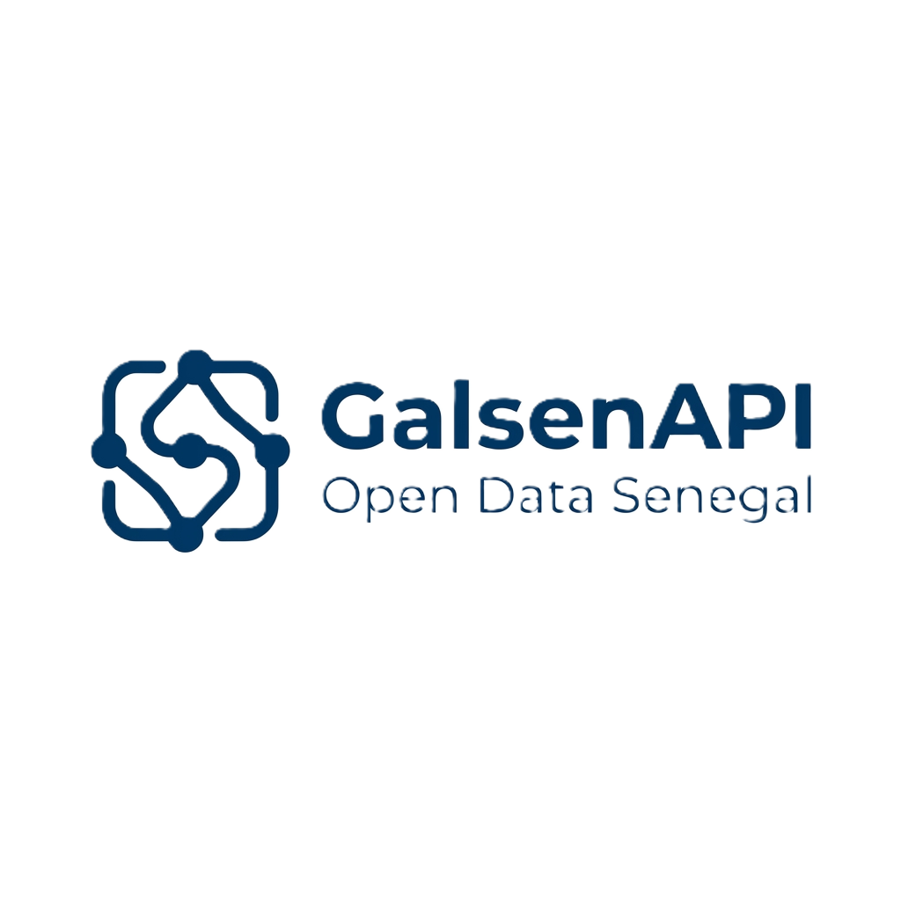

<a name="readme-top"></a>
<div align="center">
  
  <h1>GalsenAPI 2.0</h1>
  <p>
    <strong>The open platform to explore Senegal's data.</strong>
  </p>

  <p>
    <a href="./Licence.md">
      
    </a>
    <a href="https://github.com/GalsenDev221/made.in.senegal">
      
    </a>
    
    
    
  </p>

  <h4>
    <a href="https://galsenapi.lassanasiby.com/">Demo</a>
    <span> · </span>
    <a href="https://galsenapi.lassanasiby.com/docs/">API Documentation (Swagger)</a>
    <span> · </span>
    <a href="README.md">Version française</a>
  </h4>
</div>

<br />

## 📋 Table of Contents

- [Overview](#-overview)
- [Data Coverage](#-data-coverage)
- [API v1](#-api-v1)
- [Architecture](#%EF%B8%8F-architecture)
- [Installation](#%EF%B8%8F-installation)
- [Loading the Data](#-loading-the-data)
- [Tests](#-tests)
- [Data Sources & Licenses](#-data-sources--licenses)
- [Contributing](#-contributing)
- [Roadmap](#-roadmap)
- [Author & Acknowledgements](#-author--acknowledgements)

## 🚀 Overview

**GalsenAPI** is an open source platform dedicated to Senegal's public data.
It lets you discover, understand, explore and download official, sourced data —
geography, demography, agriculture, economy, climate, education — through a modern
web interface and a **documented REST API**.

> Unknown data stays unknown: no value is ever invented. Every figure is traced
> back to its source (ANSD, FAO, World Bank, NOAA, HDX…) along with its license.

## 📊 Data Coverage

| Domain | Source (license) | Volume |
|---|---|---|
| Geography | HDX COD-AB (CC BY-IGO) + Galsenify (MIT) | 14 regions · 46 departments · 125 arrondissements · 8,635 villages · GeoJSON boundaries |
| Demography | ANSD — RGPH-5 2023 (CC BY 4.0) | 18,126,388 people, by region and department, men/women |
| Agriculture | FAOSTAT (CC BY 4.0) | 105 crops · 11,694 records · 1961-2024 |
| Economy | World Bank (CC BY 4.0) | 21 indicators · 943 observations · 1960-2025 |
| Climate | NOAA GHCN-Daily (public domain) | 14 stations · 9,027 station-months · 1950-2025 |
| Education | Galsenify (MIT) | 86 higher-education institutions |

## 🌐 API v1

Base URL: `https://galsenapi.lassanasiby.com/api/v1/` — pagination (50/page, `?page_size=`
up to 200), search (`?search=`), filtering, ordering (`?ordering=`), 60 req/min per IP.

| Endpoint | Description |
|---|---|
| `regions` · `departements` · `arrondissements` · `communes` · `villages` · `pays` | Administrative hierarchy (stable P-codes) |
| `regions/geojson/` | Full boundaries (FeatureCollection, 30-min cache) |
| `regions/{pcode}/geometry/` | Single-entity geometry (lightweight) |
| `search/?q=` | Multi-entity search (`?types=`, `?limit=`) |
| `statistics/` · `statistics/regions/{pcode}/` | Aggregates computed from real data |
| `demographie/population/` | RGPH-5 2023 census (`?niveau=`, `?region=`, `?annee=`) |
| `agriculture/cultures/` · `agriculture/production/` | FAOSTAT (`?element=`, `?annee_min=`…) |
| `economie/indicateurs/` · `economie/observations/` | World Bank (`?indicateur=CODE`) |
| `climat/stations/` · `climat/observations/` | NOAA GHCN (`?station=`, `?annee_min=`) |
| `datasets/` · `datasets/{slug}/download/?format=json\|csv\|geojson` | Sourced catalog + exports |

Legacy routes `/api/<entity>/` are still served for backward compatibility.

### Examples

**curl**
```bash
curl "https://galsenapi.lassanasiby.com/api/v1/search/?q=kanel"
```

**Python**
```python
import requests

r = requests.get(
    "https://galsenapi.lassanasiby.com/api/v1/departements/",
    params={"region": "SN01", "ordering": "-population"},
)
for dept in r.json()["results"]:
    print(dept["nom"], dept["population"])
```

**JavaScript**
```js
const r = await fetch("https://galsenapi.lassanasiby.com/api/v1/statistics/");
const stats = await r.json();
console.log(stats.population.totale); // 18126388 (RGPH-5 2023)
```

**Java**
```java
var http = java.net.http.HttpClient.newHttpClient();
var req = java.net.http.HttpRequest.newBuilder()
        .uri(java.net.URI.create("https://galsenapi.lassanasiby.com/api/v1/regions/?ordering=-population"))
        .build();
var response = http.send(req, java.net.http.HttpResponse.BodyHandlers.ofString());
System.out.println(response.body());
```

## 🏗️ Architecture

```
GalsenAPi/
├── GalsenifyDj/          # settings (base/local/production), urls, frontend views, filters
├── app/                  # legacy models (compat) + frontend page tests
├── geo/                  # administrative hierarchy + HDX ingestion + API + search + stats
├── datasets/             # DataSource → Dataset → DatasetVersion → DataQualityReport + exports
├── demographie/          # RGPH-5 2023 (ANSD)
├── agriculture/          # FAOSTAT
├── economie/             # World Bank
├── climat/               # NOAA GHCN
├── templates/            # "Institutional Modern" design system (compiled Tailwind)
└── var/                  # ingest caches + quality reports (not versioned)
```

## ⚙️ Installation

Prerequisites: Python 3.12+, PostgreSQL 14+ (or SQLite to try things out).

```bash
git clone https://github.com/sibylassana95/GalsenAPi.git
cd GalsenAPi
python -m venv venv
source venv/bin/activate        # Windows: venv\Scripts\activate
pip install -r requirements.txt
cp .env.example .env            # then fill in SECRET_KEY, POSTGRES_*…
python manage.py migrate
python manage.py createsuperuser
```

### Docker

```bash
docker compose up
```

Starts Django + PostgreSQL 16. Configuration via `.env` (see `.env.example`).

## 📥 Loading the Data

```bash
python manage.py import_geo            # HDX boundaries + legacy (villages, communes)
python manage.py sync_datasets         # sources/datasets catalog
python manage.py import_demographie    # RGPH-5 2023 (data/rgph5_2023.json)
python manage.py import_agriculture    # FAOSTAT (~34 MB zip)
python manage.py import_economie       # World Bank (API)
python manage.py import_climat         # NOAA GHCN (14 stations)
```

Every command is **idempotent** (safe to re-run) and supports `--offline`
(local cache in `var/ingest/`). Quality reports are written to `var/reports/`.

## 🧪 Tests

```bash
python manage.py test
```

144 tests: models, hierarchy, ingestion, API (pagination, filters, ordering, GeoJSON),
search, statistics, exports, frontend pages.

## 📚 Data Sources & Licenses

| Source | License | Redistribution |
|---|---|---|
| [HDX COD-AB Senegal](https://data.humdata.org/dataset/cod-ab-sen) | CC BY-IGO | Allowed |
| [ANSD (RGPH-5 2023)](https://www.ansd.sn/) | CC BY 4.0 (claimed on anads.ansd.sn) | Allowed |
| [FAOSTAT](https://www.fao.org/faostat/) | CC BY 4.0 | Allowed |
| [World Bank](https://data.worldbank.org/) | CC BY 4.0 | Allowed |
| [NOAA GHCN-Daily](https://www.ncei.noaa.gov/products/land-based-station/global-historical-climatology-network-daily) | Public domain | Allowed |
| [Galsenify](https://github.com/GalsenDev221/galsenify) | MIT | Allowed |

Data whose license forbids redistribution is never copied: only metadata and a link
to the source are referenced.

## 🤝 Contributing

Contributions are welcome! See [CONTRIBUTING.md](CONTRIBUTING.md).
To report incorrect or missing data, open an issue using the
"Data correction" or "Dataset request" template.

## 🗺️ Roadmap

- [x] Phases 1-7: modernization, geo model, API v1, datasets, search/stats, data domains, frontend
- [ ] Phase 10: CI/CD GitHub Actions + pytest + security audits
- [ ] Phase 11: MCP server (GalsenAPI MCP for AI assistants)
- [ ] Official source for the ~557 communes (full department attachment)
- [ ] More domains as open sources become available (health, transport, energy)

## 👤 Author & Acknowledgements

**Lassana SIBY**

[](https://github.com/sibylassana95)
[](https://www.linkedin.com/in/sibylassana)

### Thank you to [Daouda BA](https://github.com/daoodaba975) for the original data.
[](https://github.com/daoodaba975)

## 📝 License

[](./Licence.md)

[](https://github.com/GalsenDev221/made.in.senegal)

<div align="center">
  <a href="https://www.buymeacoffee.com/sibyamara9M">
    
  </a>
  <a href="https://paypal.me/sibylassana">
    
  </a>
</div>

<p align="right">(<a href="#readme-top">back to top</a>)</p>
