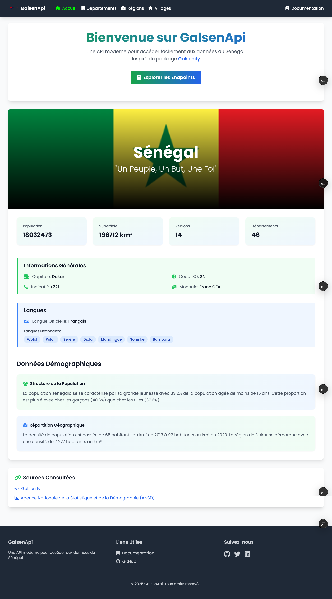
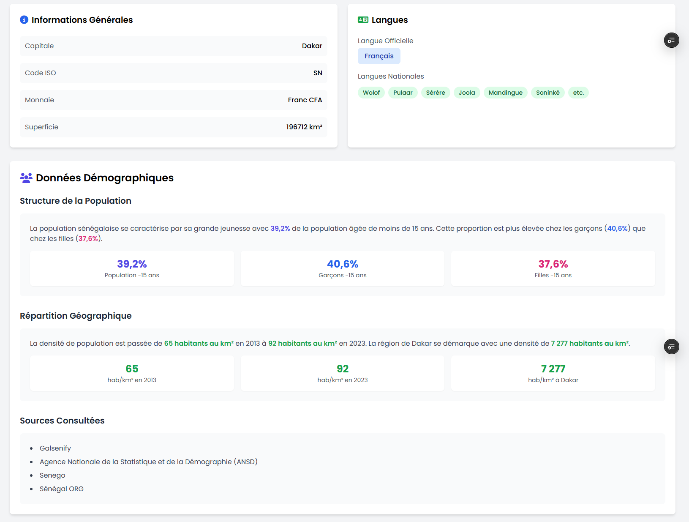
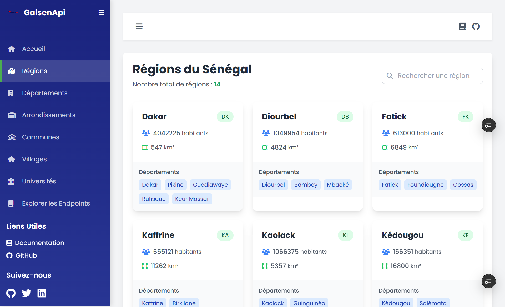

<a name="readme-top"></a>
<div align="center">
  
  <h1>GalsenApi</h1>
  <p>
    Une API moderne pour accéder facilement aux données du Sénégal 🇸🇳
  </p>

  <p>
    <a href="./Licence.md">
      
    </a>
    <a href="https://github.com/GalsenDev221/made.in.senegal">
      
    </a>
    
  </p>

  <h4>
    <a href="https://galsenapi.vercel.app/">Démo</a>
    <span> · </span>
    <a href="https://galsenapi.vercel.app/docs/">Documentation</a>
    <span> · </span>
    <a href="EN.md">English version</a>
  </h4>
</div>

<br />

## 📋 Table des matières

- [Aperçu](#-aperçu)
- [Installation](#-installation)
- [Utilisation](#-utilisation)
- [Fonctionnalités](#-fonctionnalités)
- [Technologies](#-technologies)
- [Auteur](#-auteur)
- [Remerciements](#-remerciements)

## 🚀 Aperçu

**GalsenApi** est une API REST qui vous permet d'accéder facilement aux données du Sénégal. Ce projet s'inspire du package [Galsenify](https://www.npmjs.com/package/galsenify) et fournit des informations détaillées sur :

- Les régions du Sénégal
- Les départements
- Les arrondissements
- Les communes
- Les villages
- Les Universités et Ecole de formations
- Les données démographiques
- Et plus encore...

## ⚙️ Installation

1. Créez un environnement virtuel :

```bash
python -m venv .venv
```

2. Activez l'environnement virtuel :

```bash
source .venv/bin/activate
```

3. Installez les dépendances :

```bash
pip install requirements.txt
```

4. Effectuez les migrations :

```bash
python manage.py makemigrations
python manage.py migrate
```

5. Créez un super utilisateur :

```bash
python manage.py createsuperuser
```

6. Créez un fichier `.env` dans le projet Django pour stocker la clé secrète.

## 🎯 Utilisation

### Points d'accès de l'API

#### Récupérer toutes les régions

```http
GET /api/regions/
```

#### Récupérer une seule région

```http
GET /api/regions/1/
```

#### Récupérer tous les départements

```http
GET /api/departements
```

#### Récupérer un seul département

```http
GET /api/departements/1/
```

#### Récupérer tous les arrondissements

```http
GET /api/arrondissements/
```

#### Récupérer un seul arrondissement

```http
GET /api/arrondissements/1/
```

#### Récupérer toutes les communes

```http
GET /api/communes/
```

#### Récupérer une seule commune

```http
GET /api/communes/1/
```

#### Récupérer tous les villages

```http
GET api/villages
```

#### Récupérer un seul village

```http
GET /api/villages/1
```

#### Récupérer tous les Universités et Ecole de formations

```http
GET /api/universites/
```

#### Récupérer une universite ou ecole de formation

```http
GET /api/universites/1
```

#### Récupérer les informations sur le pays

```http
GET /api/pays/
```

## 💫 Fonctionnalités

- ✨ Interface utilisateur moderne et responsive
- 📱 Compatible mobile
- 🔍 Recherche avancée
- 📊 Données détaillées et à jour
- 🔒 Sécurisé et fiable

## 🛠 Technologies

- 
- 
- 
- 

## 👤 Auteur

**Lassana SIBY**

[](https://github.com/sibylassana95)
[](https://www.linkedin.com/in/sibylassana)
[](https://twitter.com/sibyog13)

## 💝 Remerciements

### Merci à [Daouda BA](https://github.com/daoodaba975) pour les donées.
[](https://github.com/daoodaba975)

### Exemple d'utilisation de l'api 
Views region et departement
```python
def regions_view(request):
    query = request.GET.get('q')
    url = 'https://galsenapi.vercel.app/api/regions/'
    params = {'search': query} if query else {}
    response = requests.get(url, params=params)
    data = response.json()
    regions = data
    context = {'regions': regions, 'query': query}
    return render(request, 'demo/regions.html', context)


def departments_view(request):
    query = request.GET.get('q')
    url = 'https://galsenapi.vercel.app/api/departements/'
    params = {'search': query} if query else {}
    response = requests.get(url, params=params)
    data = response.json()
    departments = data
    context = {'departments': departments, 'query': query}
    return render(request, 'demo/departements.html', context)

def villages_view(request):
    query = request.GET.get('q')
    url = 'https://galsenapi.vercel.app/api/villages/'
    params = {'search': query} if query else {}
    response = requests.get(url, params=params)
    data = response.json()
    villages = data
    context = {'villages': villages, 'query': query}
    return render(request, 'demo/village.html', context)    
```






## 📝 License

[](./Licence.md)

[](https://github.com/GalsenDev221/made.in.senegal)

<p align="right">(<a href="#readme-top">back to top</a>)</p>


<div align="center">
  <a href="https://www.buymeacoffee.com/sibyamara9M">
    
  </a>
  <a href="https://paypal.me/sibylassana">
    
  </a>
</div>