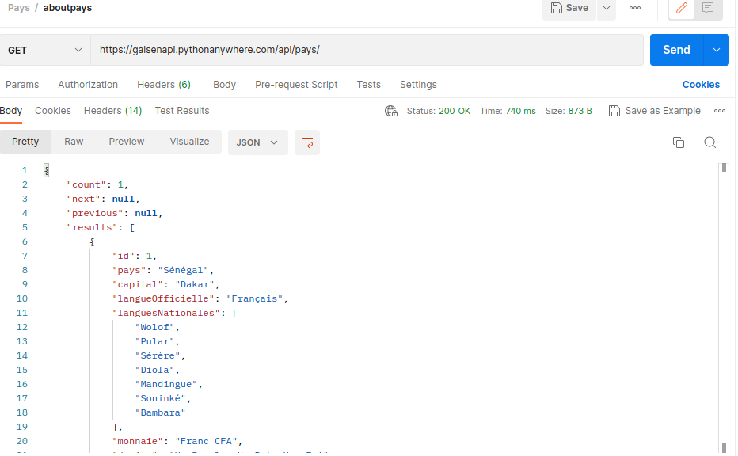
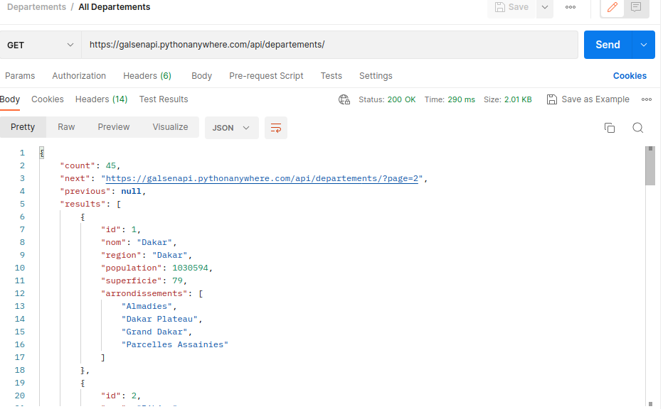
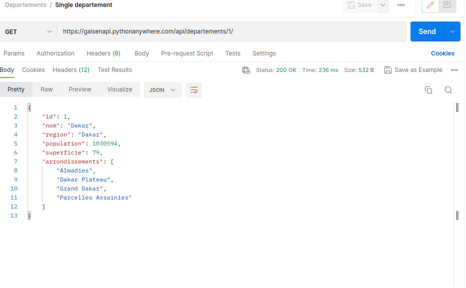
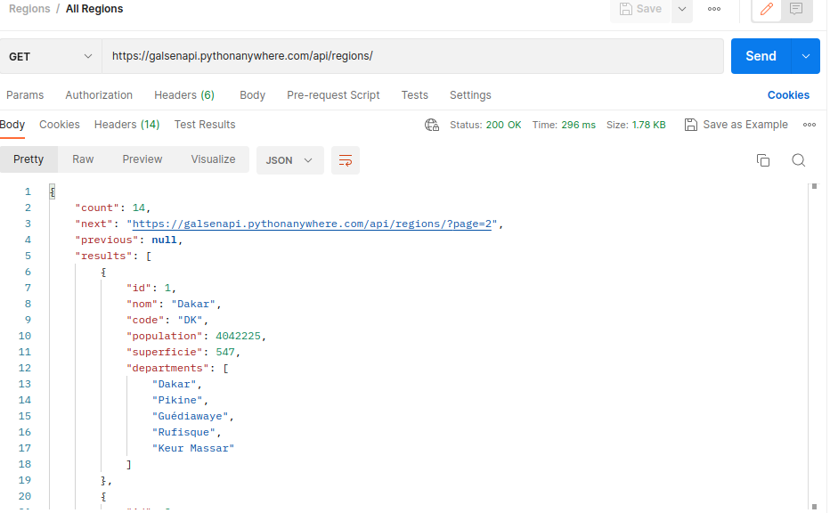
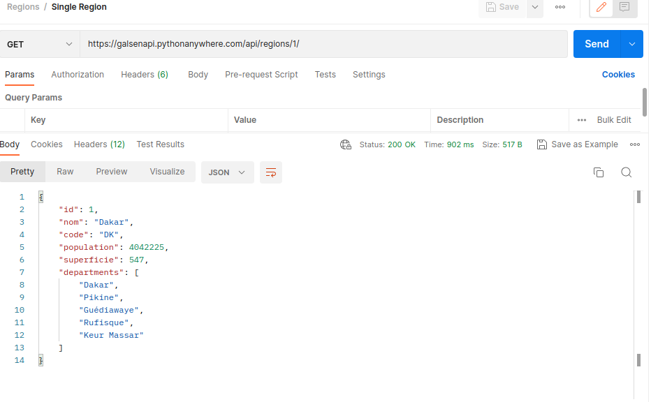
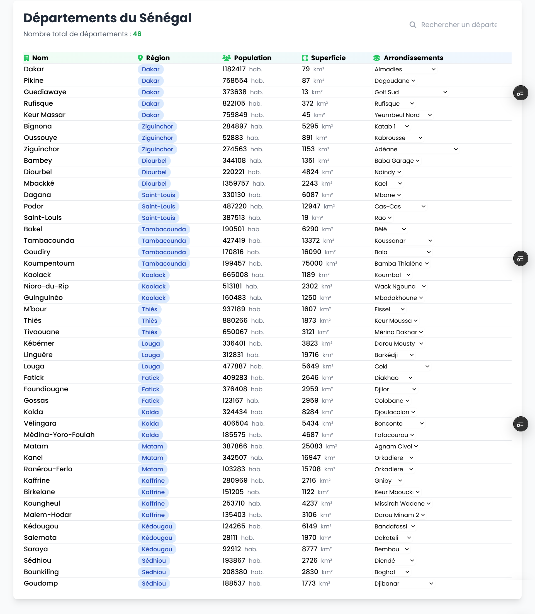
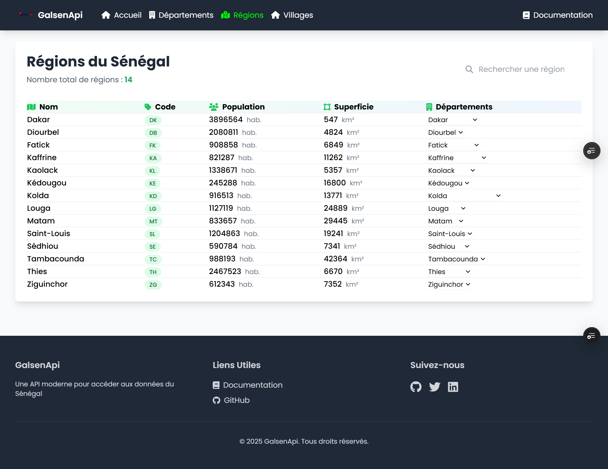

# GalsenApi

**GalsenApi** est un api qui vous permet de manipuler facilement des données sur le Sénégal.Un projet inspirer du package **[Galsenify](https://www.npmjs.com/package/galsenify)**


## Installation

Crée l'environement virtuel

```bash
  python -m venv .venv
```
Activer l'environement virtuel

```bash
  source .venv/bin/activate
```  
Installer les dépendances

```bash
  pip install requirements.txt
```
Faire les migrations

```bash
  python manage.py makemigrations
  python manage.py migrate
```    
Créer un super utulisateur 

```bash
  python manage.py createsuperuser
  
```
Créer un fichier .env dans le projet django pour stocker le secret key

## API Reference

#### Recuperer tous les Régions 
```http
  GET /api/regions/
```
#### Recuperer une seul région
```http
  GET /api/regions/1/
```
#### Recuperer  tous les départements
```http
  GET /api/departements
```
#### Recuperer un seul département
```http
  GET /api/departements/1/
```
#### Recuperer les infos du pays
```http
  GET /api/pays/
```

## Usage
Pour recuperer tous les Régions GET
https://galsenapi.pythonanywhere.com/api/regions/

exemple de resultat
```javascript
{
    "count": 14,
    "next": "https://galsenapi.pythonanywhere.com/api/regions/?page=2",
    "previous": null,
    "results": [
        {
            "id": 1,
            "nom": "Dakar",
            "code": "DK",
            "population": 4042225,
            "superficie": 547,
            "departments": [
                "Dakar",
                "Pikine",
                "Guédiawaye",
                "Rufisque",
                "Keur Massar"
            ]
        },
        {
            "id": 2,
            "nom": "Diourbel",
            "code": "DB",
            "population": 1980821,
            "superficie": 4824,
            "departments": [
                "Diourbel",
                "Bambey",
                "Mbacké"
            ]
        },
```
Pour recuperer une seul regions GET
https://galsenapi.pythonanywhere.com/api/regions/1/

exemple de resultat
```javascript
{
    {
    "id": 1,
    "nom": "Dakar",
    "code": "DK",
    "population": 4042225,
    "superficie": 547,
    "departments": [
        "Dakar",
        "Pikine",
        "Guédiawaye",
        "Rufisque",
        "Keur Massar"
    ]
}
```
## Capture
Récuperations des infos sur le pays


Récuperations de tout les Départements

Récuperations d'un seul departement

Récuperations de tout les Régions

Récuperations d'une seul région



## Author 🌟

[](https://github.com/sibylassana95)  
Created by **[Lassana SIBY](https://github.com/daoodaba975)**


## 🔗 Links
[](https://sibylassana.com/)
[](https://www.linkedin.com/in/sibylassana/)
[](https://twitter.com/sibyog13)

Un merci spécial à [Daouda BA)](https://github.com/daoodaba975) pour les donées.

## Demo

### Exemple d'utilisation de l'api 


https://galsenapi.pythonanywhere.com/
## License

[](https://choosealicense.com/licenses/mit/)

[](https://github.com/GalsenDev221/made.in.senegal)


